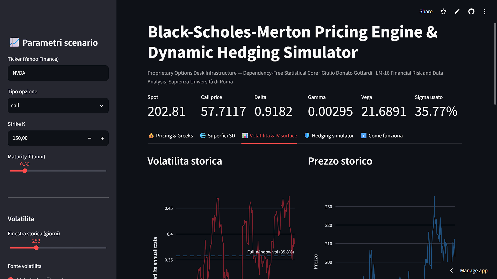

# BSM Pricing & Dynamic Hedging App

An interactive Streamlit application for **European option** pricing under Black-Scholes-Merton (BSM), numerical risk analysis, implied-volatility inversion, and discrete delta-hedging experiments. Built as a quantitative-finance coursework and portfolio project, not as production trading infrastructure.

<p align="center">
  
</p>

**Live demo:** https://bsm-pricing-hedging-app.streamlit.app/
**Course context:** Quantitative Financial Modelling, MSc Financial Risk and Data Analysis (LM-16), Sapienza University of Rome.

## Features

- **BSM pricing:** European calls and puts, including a continuous dividend-yield input `q`.
- **Custom Normal CDF:** Abramowitz-Stegun 26.2.17 approximation, implemented without SciPy; NumPy inputs are vectorized.
- **Numerical Greeks:** central finite differences for Delta, Gamma, Vega, Rho and finite-difference Theta. A validation panel compares these results with analytical BSM Greeks across several bump sizes.
- **Implied volatility:** bisection inversion with no-arbitrage price-bound checks, price residuals, iteration diagnostics, and low-Vega/ill-conditioned quote rejection.
- **Implied-volatility surface:** multi-expiry calls or puts according to the selected option type, bid/ask-mid preference, broad-spread filtering, explicit labeling of last-price fallbacks, maturity-specific interpolated rates, and no extrapolation outside observed strike ranges.
- **Discrete delta hedging:** reproducible Monte Carlo paths, configurable rebalancing frequency, vectorized simulation across paths, optional realized volatility/drift scenarios, dividend yield and proportional turnover costs.
- **Yield curve proxy:** fetches Treasury yield proxies and interpolates by maturity. The conversion is an approximation; this is not a bootstrapped zero curve.
- **Data resilience:** synthetic GBM price history and synthetic option quotes keep the app usable when Yahoo Finance data are unavailable.
- **Automated tests and CI:** parity, CDF approximation, Greeks, IV round-trip/bounds, synthetic surface recovery, and reproducible Monte Carlo tests.

## Model and interpretation notes

1. **Exercise style:** the BSM formulas implemented here price European options. Many US single-stock listed options are American-style. Applying European BSM to their quotes gives a model-implied approximation, not an official exchange IV or an American-option valuation.
2. **Volatility:** the main pricing panel uses annualized historical volatility or a user-specified volatility. The IV surface is a separate market-quote analysis; it does not silently replace the selected pricing volatility with a strike/maturity-specific IV.
3. **Market data:** Yahoo Finance quotes may be delayed, sparse, stale or missing. Mid quotes are preferred; wide spreads are filtered; last prices are only used as labeled fallbacks. The app reports rejected IV observations. Synthetic results are model-generated and must not be described as market observations.
4. **Rates:** the curve consists of Treasury-yield proxies, including a conversion approximation for the 13-week bill proxy. Linear interpolation is pragmatic but is not equivalent to bootstrapping discount factors from market instruments.
5. **Hedging:** the baseline uses risk-neutral drift `mu = r - q`, matching the BSM benchmark and isolating discretization error. Optional drift, realized-volatility and transaction-cost inputs create stress scenarios; they do not turn the simulator into a calibrated real-world risk forecast. Dividends are approximated as a continuous yield.
6. **Numerics:** Abramowitz-Stegun CDF approximation has a small nonzero approximation error. Finite-difference accuracy depends on bump size, maturity and moneyness; convergence is measured against analytical Greeks rather than assumed.
7. **Not production-ready:** no American exercise model, calibrated volatility model (e.g. SVI/SABR), arbitrage-free surface fitting, full market-data validation, discrete dividend schedule, exchange contract details, or execution/market-impact model is included.

## Project structure

```text
core.py                       Pricing, Greeks, IV, market data and hedging calculations
app.py                        Streamlit UI
tests/test_core.py            Automated numerical/regression tests
.github/workflows/tests.yml   GitHub Actions test workflow
benchmarks/benchmark_mc.py    Local vectorized-Monte-Carlo benchmark
requirements.txt              Runtime dependencies
```

## Run locally

```bash
python -m venv .venv
# Windows: .venv\Scripts\activate
# macOS/Linux: source .venv/bin/activate
pip install -r requirements.txt
streamlit run app.py
```

Run the test suite:

```bash
pip install pytest
pytest -q
```

## Validation

The automated tests verify:

- custom CDF approximation against `math.erfc` reference values;
- put-call parity with and without dividend yield;
- finite-difference Greeks against analytical BSM formulas;
- implied-volatility round-trip recovery and rejection of prices outside European no-arbitrage bounds;
- recovery of the synthetic volatility surface;
- deterministic Monte Carlo output for a fixed seed;
- hedging scenario inputs and transaction-cost accounting.

These are model/unit tests, not evidence of profitability or a substitute for independent model validation. To benchmark the vectorized Monte Carlo against the per-path implementation on your own machine, run `python benchmarks/benchmark_mc.py`; timing ratios are hardware- and environment-dependent.

## Deployment

The app can be deployed on [Streamlit Community Cloud](https://streamlit.io/cloud) by connecting a fork and selecting `app.py` as the entry point. Public demo availability depends on the hosting service and may sleep when inactive.

## Author

**Giulio Gottardi** - MSc Financial Risk and Data Analysis (LM-16), Sapienza University of Rome.
