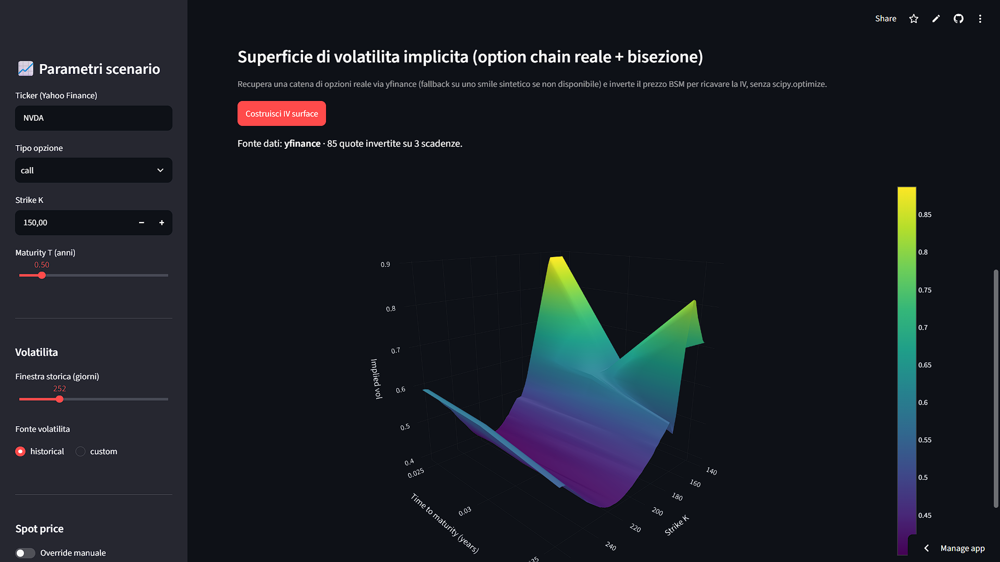

# BSM Pricing Engine & Dynamic Hedging Desk

<p align="center">
  
  
</p>

An interactive Streamlit application for pricing European options under Black-Scholes-Merton,
exploring their Greeks across price/time surfaces, backing out implied volatility from live
option chains, and stress-testing discrete delta-hedging via Monte Carlo simulation — built
with a dependency-free statistical core.

**[Live demo →](https://bsm-pricing-hedging-app.streamlit.app/)** · Built as part of the
Quantitative Financial Modelling coursework, LM-16 Financial Risk and Data Analysis, Sapienza
Università di Roma.

---

## Overview

Most BSM implementations lean on `scipy.stats.norm` and closed-form Greeks. This project
rebuilds the pricing and risk stack from first principles instead, as an options desk might
when auditing a black-box library or pricing a payoff with no closed form:

- The standard Normal CDF is implemented from scratch via the Abramowitz & Stegun (1964)
  rational polynomial approximation — accurate to ~1e-7, no `scipy` dependency.
- Greeks are computed by finite differences on the pricer itself, not analytically —
  the same technique used to validate a pricer against exotic or path-dependent payoffs.
- Implied volatility is recovered by bisection, not `scipy.optimize`.
- Delta-hedging is simulated with discrete rebalancing (daily/weekly/monthly), making the
  hedging error that continuous-time theory assumes away explicit and measurable.

The app pulls live spot prices, a live Treasury yield curve, and live option chains via
`yfinance`, with reproducible synthetic fallbacks so it degrades gracefully when the network
or the data provider is unavailable.

## Key Features

- **Pricing & Greeks** — European call/put pricing with all five Greeks (Delta, Gamma, Theta,
  Vega, Rho), each cross-checked for finite-difference convergence.
- **3D surfaces** — interactive price and Greek surfaces over (spot, time-to-maturity).
- **Volatility** — historical/rolling realized volatility, plus a genuine implied volatility
  surface built from a real multi-expiration option chain and bisection inversion.
- **Hedging simulator** — single-path diagnostics and a full Monte Carlo P&L distribution for
  discretely-rebalanced delta hedging, with tracking error compared across rebalancing
  frequencies.
- **Live market data, no hardcoded assumptions** — spot price and risk-free rate default to
  live values (last close; yield curve interpolated to the selected maturity), each with a
  manual-override toggle for scenario analysis.

## Technical Highlights

| Area | Approach |
|---|---|
| Normal CDF | Abramowitz & Stegun 26.2.17 polynomial approximation (no `scipy`) |
| Greeks | Central finite differences, convergence-checked against a tighter step |
| Implied vol | Bisection root-finding on the pricer (no `scipy.optimize`) |
| Risk-free rate | Live Treasury yield curve (`^IRX`/`^FVX`/`^TNX`/`^TYX`), linearly interpolated to maturity |
| Hedging | Discrete delta-hedging Monte Carlo, GBM paths, rebalancing-frequency comparison |
| Data resilience | Every live data call has a reproducible synthetic fallback |

## Project Structure

```
core.py           Pure computation: pricing, Greeks, hedging, IV — no I/O, no plotting
app.py            Streamlit UI: sidebar controls + 5 analysis tabs
requirements.txt  Dependencies
```

## Running Locally

```bash
pip install -r requirements.txt
streamlit run app.py
```

## Deployment

Deployed on [Streamlit Community Cloud](https://streamlit.io/cloud). To deploy your own copy:
fork this repo, connect it at [share.streamlit.io](https://share.streamlit.io), and point it
at `app.py`.

## Author

**Giulio Gottardi** — MSc Financial Risk and Data Analysis (LM-16), Sapienza Università di Roma.
Originally developed as a pricing-engine deliverable for the Quantitative Financial Modelling
course.
